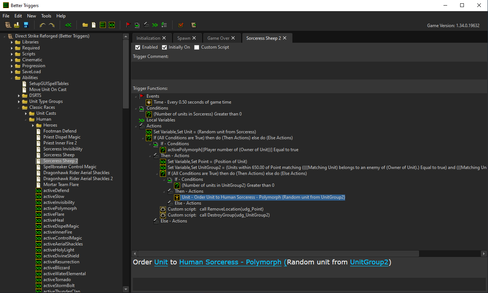
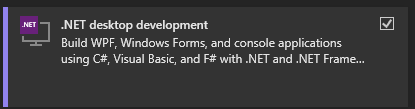
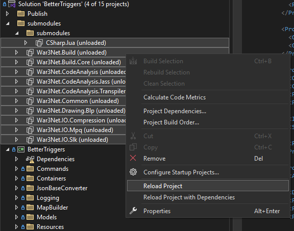

# BetterTriggers
A custom Warcraft III trigger editor.



## Required to run:
- Windows 7 or greater
- [.NET 6.0 Desktop Runtime x64](https://dotnet.microsoft.com/en-us/download/dotnet/thank-you/runtime-desktop-6.0.24-windows-x64-installer)
- Warcraft III 1.28.5 or greater

## User documentation
https://thelazzoro.github.io/BetterTriggersGuide/

## Developer setup installation
Install [Visual Studio](https://visualstudio.microsoft.com/)

From the setup window select .NET desktop development:



Install [.NET 6.0 SDK x64](https://dotnet.microsoft.com/en-us/download/dotnet/thank-you/sdk-6.0.428-windows-x64-installer)


BetterTriggers uses git submodules. To initialize these open a console from the root directory and type the following:

```
git submodule update --init --recursive
```

Now an additional repository named 'War3Net' has been downloaded.

In Visual Studio, select all submodules, right-click and select 'Reload Project'. 



You should now be set.
